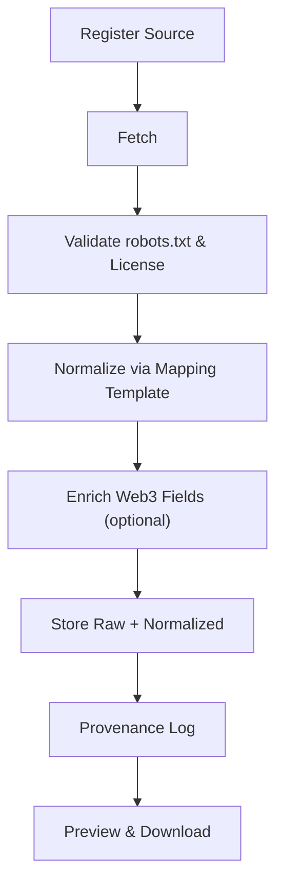
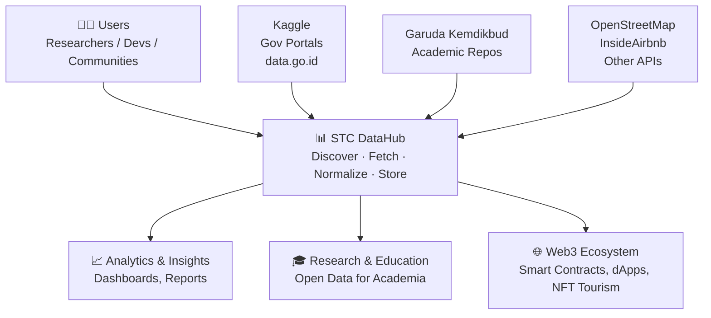

# STC DataHub 📈

STC DataHub adalah platform standalone untuk discover, fetch, scrape, normalize, dan store dataset pariwisata dari berbagai sumber.
Tujuan utamanya adalah menyediakan hub data yang bisa diperluas lewat sistem connector-driven, sehingga dataset baru bisa ditambahkan tanpa perlu mengubah kode utama.

[](https://github.com/mrbrightsides/stc-datahub/actions)
[](https://hub.docker.com/r/elpeef/stc-datahub)
[](https://www.python.org/)
[](https://reactjs.org/)
[](LICENSE)
[](https://github.com/mrbrightsides/stc-datahub)

> 💡 MVP ini fokus pada reliability, provenance, dan kemudahan menambah konektor.

---

## ✨ Features

- 🔌 Connector-driven architecture (Kaggle, CSV/JSON, HTML, XHR, OSM, Airbnb, dsb).

- 📦 Data pipeline: Fetch → Validate → Normalize → Enrich → Store → Provenance Log.

- 🗂️ Multi-format output: CSV, NDJSON, Parquet.

- 🔄 Versioning: snapshot raw data + mapping history.

- 👩‍💻 Admin UI: register source, mapping schema, scheduling, preview 100 rows.

- ⚖️ Legal & safe: robots.txt check, TOS/license stored, polite crawling.

- 🌐 API ready: FastAPI backend with OpenAPI docs.

- 🐳 Dockerized stack: deploy with docker-compose up.

---

## 🏗️ Tech Stack

- Backend: Python (FastAPI)

- Frontend: React (Vite/Next.js optional)

- Database: PostgreSQL (or DuckDB for quick local runs)

- Object Storage: S3-compatible (e.g. MinIO, AWS S3)

- Queue: Redis

- Orchestration: Docker Compose

---

## 🔌 Example Connectors (MVP)

- Kaggle → via Kaggle API (kaggle.json auth).

- Generic HTTP → download direct CSV/JSON.

- HTML Scraper → requests + BeautifulSoup, dengan robots.txt check.

- XHR/JSON → auto-detect JSON endpoints dari halaman.

- OpenStreetMap → POI pull via Overpass API.

- Garuda (Kemdikbud) → pencarian dataset publikasi pariwisata.

---

## ⚙️ Pipeline





---

## 📂 Project Structure

```bash
stc-datahub/
│── backend/          # FastAPI + connectors
│   ├── connectors/
│   │   ├── kaggle.py
│   │   ├── http_csv.py
│   │   ├── html_scraper.py
│   │   ├── xhr_json.py
│   │   └── osm.py
│   ├── models/
│   ├── api/
│   └── main.py
│
│── frontend/         # React (Vite/Next.js optional)
│   └── src/
│
│── storage/          # Raw + normalized data
│── docker-compose.yml
│── .env.example
│── README.md
```

---

## 🚀 Quick Start

1. Clone repo:
```bash
git clone https://github.com/elpeef/stc-datahub.git
cd stc-datahub
```

2. Copy env:
```bash
cp .env.example .env
```

3. Run with Docker:
```bash
docker-compose up --build
```

4. Access services:

- FastAPI docs → http://localhost:8000/docs

- React Admin UI → http://localhost:3000

---

## 📝 Roadmap (MVP → Extended)

- Kaggle connector

- Garuda HTML search connector

- Generic HTTP CSV/JSON connector

- Admin UI for dataset mapping

- Scheduling via cron

- Selenium connector for JS-heavy sites

- SIWE (Sign-In with Ethereum) for secure dataset access

---

## 📜 License

MIT License. Dataset usage subject to respective source licenses.
