# RANTAI DataHub 📈 - Advanced Tourism Data Processing Platform

<div align="center">


[](https://github.com/mrbrightsides/stc-datahub/actions)
[](https://hub.docker.com/r/elpeef/stc-datahub)
[](https://www.python.org/)
[](https://reactjs.org/)
[](LICENSE)
[](https://github.com/mrbrightsides/stc-datahub)

**Intelligent tourism data aggregation, normalization, and visualization platform with real-time collaboration**

[Features](#-features) • [Quick Start](#-quick-start) • [API Docs](./API_DOCS.md) • [Architecture](./ARCHITECTURE.md) • [Contributing](./CONTRIBUTING.md)

</div>

---

## 📖 Overview

STC DataHub adalah platform canggih untuk agregasi, normalisasi, dan visualisasi data pariwisata dari berbagai sumber. Dilengkapi dengan AI-powered insights, real-time collaboration, dan interactive visualizations yang membuat data tourism menjadi hidup!

### 🎯 Key Highlights

- **🔄 Real-time Collaboration** - Multi-user collaboration powered by SpacetimeDB
- **🤖 AI-Powered Insights** - Smart recommendations & data quality analysis
- **🗺️ Interactive Maps** - Leaflet-based geographic visualization with heatmaps
- **📊 Custom Dashboards** - Drag-and-drop widget builder
- **🌐 Multi-language** - Full i18n support (English & Indonesian)
- **🔗 REST API** - Public API endpoints for data sharing
- **📦 7-Format Export** - CSV, JSON, Excel, SQL, XML, NDJSON, Parquet

---

## ✨ Features

### 🚀 Data Processing Pipeline

5-stage intelligent pipeline:
1. **Fetch** - Connect to real data sources (REST Countries, OpenStreetMap, Open Brewery)
2. **Validate** - Schema validation & data quality checks
3. **Normalize** - Intelligent field mapping & standardization
4. **Enrich** - Add metadata, geocoding, categorization
5. **Store** - Persist to database with versioning

### 📊 Visualization Suite

- **Interactive Maps** - Pin-based geographic visualization with Leaflet
- **Heatmap Analysis** - Density visualization for tourism hotspots
- **Charts & Graphs** - Distribution, trends, and comparative analytics
- **Before/After Preview** - Data transformation showcases
- **Real-time Feed** - Live processing intelligence updates

### 🔍 Advanced Features

- **Multi-criteria Filtering** - Search, category, country, price, rating filters
- **Data Export** - 7 formats with filtered data support
- **AI Recommendations** - Pattern detection & actionable insights
- **Custom Dashboards** - Personalized widget layouts
- **Real-time Collaboration** - See other users & live changes
- **Public REST API** - Share data via HTTP endpoints

### 🌐 Multi-language Support

Full UI translation in:
- 🇬🇧 English
- 🇮🇩 Bahasa Indonesia

---

## 🚀 Quick Start

### Prerequisites

- Node.js 18+ 
- npm/yarn/pnpm
- SpacetimeDB CLI (optional, for collaboration features)

### Installation

```bash
# Clone repository
git clone https://github.com/yourusername/stc-datahub.git
cd stc-datahub

# Install dependencies
npm install

# Run development server
npm run dev
```

Open [http://localhost:3000](http://localhost:3000) 🎉

### SpacetimeDB Setup (Optional)

For real-time collaboration features:

```bash
# Install SpacetimeDB CLI
curl --proto '=https' --tlsv1.2 -sSf https://install.spacetimedb.com | sh

# Start local SpacetimeDB server
spacetime start

# Publish module
cd spacetime-server
spacetime publish stc-datahub --clear-database

# Module will auto-connect from Next.js app
```

---

## 📚 Documentation

- **[API Documentation](./API_DOCS.md)** - REST API endpoints & usage
- **[Architecture Overview](./ARCHITECTURE.md)** - Technical design & data flow
- **[Contributing Guide](./CONTRIBUTING.md)** - How to contribute
- **[Deployment Guide](./DEPLOYMENT.md)** - Production deployment

---

## 🏗️ Tech Stack

### Frontend
- **Next.js 15** - React framework with App Router
- **TypeScript** - Type-safe development
- **Tailwind CSS** - Utility-first styling
- **shadcn/ui** - Component library
- **Recharts** - Data visualization
- **Leaflet** - Interactive maps
- **react-grid-layout** - Dashboard builder
- **i18next** - Internationalization

### Backend & Data
- **SpacetimeDB** - Real-time database & collaboration
- **REST API** - Data sharing endpoints
- **Real Data Sources**:
  - REST Countries API
  - OpenStreetMap Overpass API
  - Open Brewery DB

### AI & Analytics
- Custom pattern detection engine
- Data quality analyzer
- Smart recommendations system

---

## ⚙️ Pipeline

```mermaid
flowchart TD
    A[👩‍💻 Users\nResearchers / Devs / Communities] --> B[📊 STC DataHub\nDiscover · Fetch · Normalize · Store]
    C[Kaggle\nGov Portals\ndata.go.id] --> B
    D[Garuda Kemdikbud\nAcademic Repos] --> B
    E[OpenStreetMap\nInsideAirbnb\nOther APIs] --> B
    B --> F[📈 Analytics & Insights\nDashboards, Reports]
    B --> G[🎓 Research & Education\nOpen Data for Academia]
    B --> H[🌐 Web3 Ecosystem\nSmart Contracts, dApps, NFT Tourism]
```




---

## 🎯 Use Cases

### Tourism Industry
- **Destination Discovery** - Find and analyze tourism attractions
- **Market Research** - Compare destinations, pricing, ratings
- **Data Standardization** - Normalize disparate data sources

### Data Analysis
- **Geographic Analysis** - Heatmaps and spatial distributions
- **Trend Analysis** - Rating trends, pricing patterns
- **Quality Control** - Data completeness and accuracy checks

### Collaboration
- **Team Workflows** - Real-time multi-user data processing
- **Shared Insights** - Collaborative analysis and annotations
- **Live Updates** - See changes as they happen

---

## 📦 Project Structure

```
stc-datahub/
├── src/
│   ├── app/                    # Next.js App Router
│   │   ├── api/                # API routes
│   │   │   ├── data-share/     # Public data API
│   │   │   ├── stats/          # Statistics API
│   │   │   └── proxy/          # External API proxy
│   │   ├── layout.tsx          # Root layout
│   │   └── page.tsx            # Main dashboard
│   ├── components/
│   │   ├── dashboard/          # Dashboard components
│   │   ├── visualization/      # Charts, maps, heatmaps
│   │   ├── collaboration/      # Real-time features
│   │   └── ui/                 # shadcn/ui components
│   ├── lib/
│   │   ├── real-data-sources.ts      # API connectors
│   │   ├── data-export-utils.ts      # Export utilities
│   │   ├── ai-insights-engine.ts     # AI analysis
│   │   └── i18n.ts                   # Translations
│   ├── spacetime_module_bindings/    # SpacetimeDB client
│   └── hooks/                         # Custom React hooks
├── spacetime-server/
│   └── src/
│       └── lib.rs              # SpacetimeDB Rust module
├── public/                     # Static assets
└── docs/                       # Additional documentation
```

---

## 🔗 API Endpoints

### GET `/api/data-share`

Fetch tourism data with filtering & pagination.

```bash
# Example
curl "http://localhost:3000/api/data-share?category=hotel&country=Indonesia&page=1&limit=10"
```

### GET `/api/stats`

Get aggregated statistics.

```bash
curl "http://localhost:3000/api/stats"
```

See [API_DOCS.md](./API_DOCS.md) for complete documentation.

---

## 🤝 Contributing

We welcome contributions! Please see [CONTRIBUTING.md](./CONTRIBUTING.md) for guidelines.

### Quick Contribution Steps

1. Fork the repository
2. Create feature branch: `git checkout -b feature/amazing-feature`
3. Commit changes: `git commit -m 'Add amazing feature'`
4. Push to branch: `git push origin feature/amazing-feature`
5. Open Pull Request

---

## 📄 License

This project is licensed under the MIT License - see the [LICENSE](./LICENSE) file for details.

---

## 🙏 Acknowledgments

- **SpacetimeDB** - Real-time database infrastructure
- **shadcn/ui** - Beautiful component library
- **Leaflet** - Open-source mapping
- **REST Countries** - Country data API
- **OpenStreetMap** - Geographic data

---

## 📞 Support

- **Issues**: [GitHub Issues](https://github.com/yourusername/stc-datahub/issues)
- **Discussions**: [GitHub Discussions](https://github.com/yourusername/stc-datahub/discussions)
- **Email**: support@stcdatahub.com

---

## 🗺️ Roadmap

- [ ] Additional data source connectors
- [ ] Machine learning model integration
- [ ] Advanced data transformation rules
- [ ] Team workspaces & permissions
- [ ] Mobile app (React Native)
- [ ] GraphQL API
- [ ] Data versioning & time travel
- [ ] Export scheduling & automation

---

<div align="center">

**Made with ❤️ by the STC DataHub Team**

⭐ Star us on GitHub if you find this project useful!

</div>
